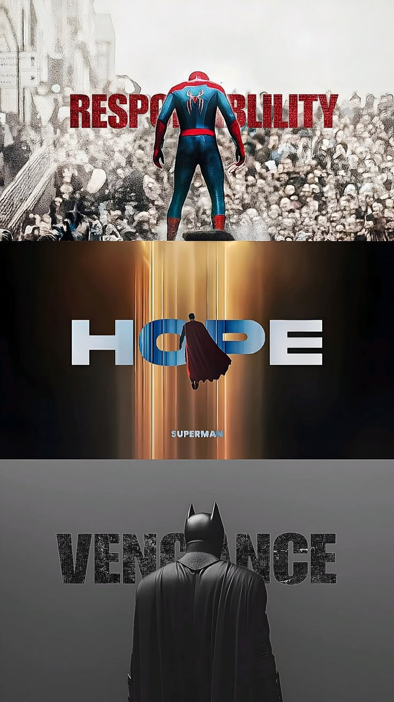

# 🎬 Take Your Ticket

  

  <b>A Flask-based movie ticket booking system with MySQL, REST APIs, authentication, and transaction-safe seat booking.</b>

## Overview

**Take Your Ticket** is a Flask-based movie ticket booking system built with **Python, MySQL, Jinja2, HTML, and CSS**.

The application provides end-to-end movie booking functionality, including movie and show discovery, seat selection, booking management, user authentication, role-based authorization, and REST APIs.

The booking workflow uses **database transactions, row-level locking, seat availability validation, and concurrency control** to safely handle competing booking requests.

## Key Features

### 🎬 Movie & Show Discovery
- Browse available movies and scheduled shows
- Filter movies by city, theatre, and date
- View detailed movie and show information

### 🎟️ Seat Booking
- View seat availability for each show
- Select multiple seats for booking
- Validate seat selections against the show's screen
- Prevent duplicate seat selection and conflicting bookings
- Calculate booking prices server-side

### 🔐 Authentication & Authorization
- User registration and login
- Session-based authentication
- Protected booking operations
- Role-based authorization for administrative functionality

### 🔌 REST APIs
- Versioned REST endpoints under `/api/v1/`
- JSON-based request and response handling
- Appropriate HTTP status codes for successful and failed operations

### 🗄️ Database & Concurrency
- Relational MySQL database for movies, theatres, shows, seats, and bookings
- Transactional booking workflow
- Row-level locking using `SELECT ... FOR UPDATE`
- Seat availability validation during booking
